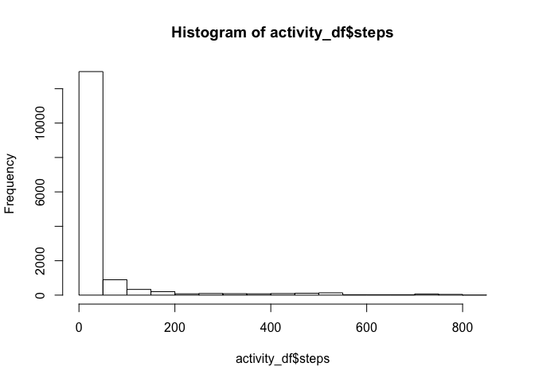
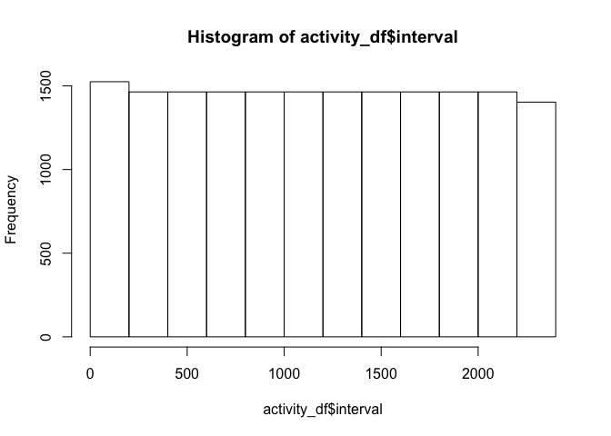
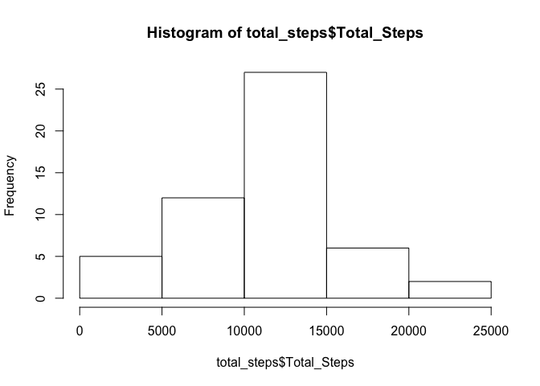
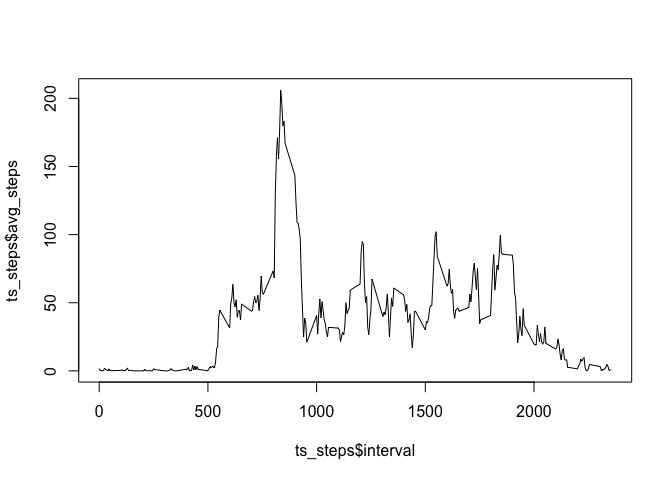
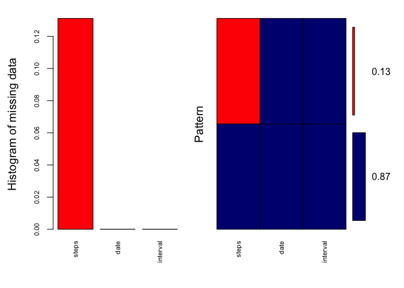
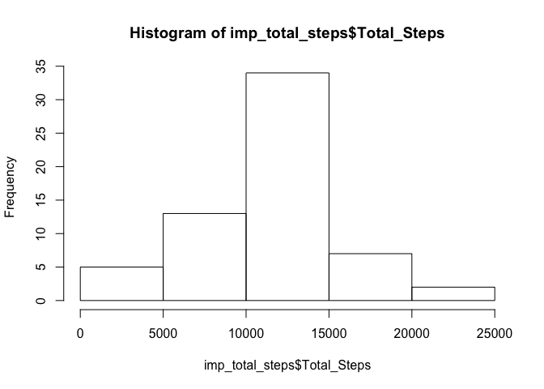

# Reproducible Research: Peer Assessment 1


## Loading and preprocessing the data
The data was provided in the repository for this assignment; in the zip file called activity.zip.


```r
## create a local directory for the data
localDir <- "activity_data"
if (!file.exists(localDir)) {
  dir.create(localDir)
}

## download and unzip the data
file <- 'activity.zip'
if (file.exists(file)) {
  unzip(file,exdir=localDir)
}
```

This creates a file named 'activity.csv' in the sub-folder 'activity_data'.


```r
## load the data
activity_df <- read.csv('activity_data/activity.csv')
```

What does the data look like? This was not required for the assignment, but I find it helpful.   


```r
## examine the dataset
str(activity_df)
```

```
## 'data.frame':	17568 obs. of  3 variables:
##  $ steps   : int  NA NA NA NA NA NA NA NA NA NA ...
##  $ date    : Factor w/ 61 levels "2012-10-01","2012-10-02",..: 1 1 1 1 1 1 1 1 1 1 ...
##  $ interval: int  0 5 10 15 20 25 30 35 40 45 ...
```

```r
hist(activity_df$steps)
```

 

```r
hist(activity_df$interval)
```

 

```r
unique(activity_df$date)
```

```
##  [1] 2012-10-01 2012-10-02 2012-10-03 2012-10-04 2012-10-05 2012-10-06
##  [7] 2012-10-07 2012-10-08 2012-10-09 2012-10-10 2012-10-11 2012-10-12
## [13] 2012-10-13 2012-10-14 2012-10-15 2012-10-16 2012-10-17 2012-10-18
## [19] 2012-10-19 2012-10-20 2012-10-21 2012-10-22 2012-10-23 2012-10-24
## [25] 2012-10-25 2012-10-26 2012-10-27 2012-10-28 2012-10-29 2012-10-30
## [31] 2012-10-31 2012-11-01 2012-11-02 2012-11-03 2012-11-04 2012-11-05
## [37] 2012-11-06 2012-11-07 2012-11-08 2012-11-09 2012-11-10 2012-11-11
## [43] 2012-11-12 2012-11-13 2012-11-14 2012-11-15 2012-11-16 2012-11-17
## [49] 2012-11-18 2012-11-19 2012-11-20 2012-11-21 2012-11-22 2012-11-23
## [55] 2012-11-24 2012-11-25 2012-11-26 2012-11-27 2012-11-28 2012-11-29
## [61] 2012-11-30
## 61 Levels: 2012-10-01 2012-10-02 2012-10-03 2012-10-04 ... 2012-11-30
```


## What is mean total number of steps taken per day?


```r
# For this part of the assignment, you can ignore the missing values in the dataset.

# Calculate the total number of steps taken per day
library(dplyr)
```

```
## 
## Attaching package: 'dplyr'
## 
## The following objects are masked from 'package:stats':
## 
##     filter, lag
## 
## The following objects are masked from 'package:base':
## 
##     intersect, setdiff, setequal, union
```

```r
total_steps <- group_by(activity_df, date) %>%
  mutate(sum(steps)) %>%
  select(-steps,-interval) %>%
  distinct()
  
names(total_steps) <- c("Date", "Total_Steps")

## Make a histogram of the total number of steps taken each day
hist(total_steps$Total_Steps)
```

 

```r
# Calculate and report the mean and median of the total number of steps taken per day
mean_total_steps <- mean(total_steps$Total_Step, na.rm = TRUE)
median_total_steps <- median(total_steps$Total_Step, na.rm = TRUE)
```

mean: 1.0754923\times 10^{4}  
median: 1.06825\times 10^{4}

## What is the average daily activity pattern?

```r
# Make a time series plot (i.e. type = "l") of the 5-minute interval (x-axis) and the average number of steps taken, averaged across all days (y-axis)
ts_steps <- activity_df[!is.na(activity_df$steps),] %>%
  group_by(interval) %>%
  mutate(mean(steps)) %>%
  select(-steps, -date) %>%
  distinct()

names(ts_steps) <- c("interval", "avg_steps")

plot(ts_steps$interval, ts_steps$avg_steps, type = "l")
```

 

```r
# Which 5-minute interval, on average across all the days in the dataset, contains the maximum number of steps?
max_steps <- max(ts_steps$avg_steps)
interval_w_max <- filter(ts_steps, avg_steps == max_steps)

library(knitr)
kable(interval_w_max)
```


 interval   avg_steps
---------  ----------
      835    206.1698

## Imputing missing values  

Note that there are a number of days/intervals where there are missing values (coded as NA). The presence of missing days may introduce bias into some calculations or summaries of the data.

Calculate and report the total number of missing values in the dataset (i.e. the total number of rows with NAs)

```r
count_missing_values <- count(activity_df[is.na(activity_df$steps),])
```
Missing values: 2304

Requirement: Devise a strategy for filling in all of the missing values in the dataset. The strategy does not need to be sophisticated. For example, you could use the mean/median for that day, or the mean for that 5-minute interval, etc.

My preference is to use a linear regression between the two nearest non-missing values. In this case I would order the data by date and interval. If only one interval is missing, the imputed value would be the average of the two nearest. 

Figuring out how to implement this strategy seems like a daunting task. Fortunately R is continuously evolving, and there is a good chance someone else has already created a package to solve this problem. After a quick internet search, I decided to go with the approach described in this blog post: http://www.r-bloggers.com/imputing-missing-data-with-r-mice-package/

The blog suggests using mice::md.pattern() to get a sense of the missing data.


```r
library(mice)
md.pattern(activity_df)
```

```
##       date interval steps     
## 15264    1        1     1    0
##  2304    1        1     0    1
##          0        0  2304 2304
```
This shows that there are 15,264 complete samples and 2,304 are missing steps data. This matches our earlier count of missing values which was 2304.

The blog also suggests the use of VIM::aggr to visualize


```r
library(VIM)
aggr_plot <- aggr(activity_df, col=c('navyblue','red'), numbers=TRUE, sortVars=TRUE, labels=names(activity_df), cex.axis=.7, gap=3, ylab=c("Histogram of missing data","Pattern"))
```

 

```
## 
##  Variables sorted by number of missings: 
##  Variable     Count
##     steps 0.1311475
##      date 0.0000000
##  interval 0.0000000
```
This chart shows that the only missing data occurs in the 'steps' vector.

Requirement: Create a new dataset that is equal to the original dataset but with the missing data filled in.


```r
imputed_df <- mice(activity_df, m = 5, method = 'pmm', seed = 42)
```

```
## 
##  iter imp variable
##   1   1  steps
##   1   2  steps
##   1   3  steps
##   1   4  steps
##   1   5  steps
##   2   1  steps
##   2   2  steps
##   2   3  steps
##   2   4  steps
##   2   5  steps
##   3   1  steps
##   3   2  steps
##   3   3  steps
##   3   4  steps
##   3   5  steps
##   4   1  steps
##   4   2  steps
##   4   3  steps
##   4   4  steps
##   4   5  steps
##   5   1  steps
##   5   2  steps
##   5   3  steps
##   5   4  steps
##   5   5  steps
```

```r
# pmm stands for 'predictive mean matching'
# for reproducibility, the seed is set for the random number generator

summary(imputed_df)
```

```
## Multiply imputed data set
## Call:
## mice(data = activity_df, m = 5, method = "pmm", seed = 42)
## Number of multiple imputations:  5
## Missing cells per column:
##    steps     date interval 
##     2304        0        0 
## Imputation methods:
##    steps     date interval 
##    "pmm"    "pmm"    "pmm" 
## VisitSequence:
## steps 
##     1 
## PredictorMatrix:
##          steps date interval
## steps        0    1        1
## date         0    0        0
## interval     0    0        0
## Random generator seed value:  42
```

```r
imputed_activity_df <- complete(imputed_df)
```

Requirement: Make a histogram of the total number of steps taken each day and Calculate and report the mean and median total number of steps taken per day. Do these values differ from the estimates from the first part of the assignment? What is the impact of imputing missing data on the estimates of the total daily number of steps?


```r
# Calculate the total number of steps taken per day
library(dplyr)
imp_total_steps <- group_by(imputed_activity_df, date) %>%
  mutate(sum(steps)) %>%
  select(-steps,-interval) %>%
  distinct()
  
names(imp_total_steps) <- c("Date", "Total_Steps")

## Make a histogram of the total number of steps taken each day
hist(imp_total_steps$Total_Steps)
```

 

```r
# Calculate and report the mean and median of the total number of steps taken per day
imp_mean_total_steps <- mean(imp_total_steps$Total_Step)
imp_median_total_steps <- median(imp_total_steps$Total_Step)
```

This method exaggerates the mean.

Omitting missing values resulted in
mean: 1.0754923\times 10^{4}  
median: 1.06825\times 10^{4}

Imputing missing values with predictive mean matching resulted in
mean: 1.1140574\times 10^{4}  
median: 11352


## Are there differences in activity patterns between weekdays and weekends?


```r
# I set eval = FALSE for this chunk because the chart doesn't render. Hopefully, I can fix before the deadline. If not perhaps you could be so kind as to offer your approach in the comments section. Thank you.

# For this part the weekdays() function may be of some help here. Use the dataset with the filled-in missing values for this part.


# Create a new factor variable in the dataset with two levels – “weekday” and “weekend” indicating whether a given date is a weekday or weekend day.
library(lubridate)
imputed_activity_df$day_type <- weekdays(as.Date(imputed_activity_df$date)) 

# Identify Weekend/Weekday days by the name of the day
weekend_df <- filter(imputed_activity_df, day_type == 'Sunday' | day_type == 'Saturday') %>%
  mutate(WW = 'Weekend')
weekday_df <- filter(imputed_activity_df, day_type != 'Sunday' & day_type != 'Saturday') %>%
  mutate(WW = 'Weekday')


# shape data for the plot
plot_df <- rbind(weekday_df, weekend_df) %>%
  group_by(interval,WW) %>%
  mutate(mean(steps)) %>%
  select(-steps, -date, -day_type) %>%
  distinct()

names(plot_df) <- c('Interval', 'WW', 'Average_Steps')


# Make a panel plot containing a time series plot (i.e. type = "l") of the 5-minute interval (x-axis) and the average number of steps taken, averaged across all weekday days or weekend days (y-axis). See the README file in the GitHub repository to see an example of what this plot should look like using simulated data.


  plot(x = plot_df$Inteval, y = plot_df$Average_Steps, type = 'l', colour = plot_df$WW)
```
